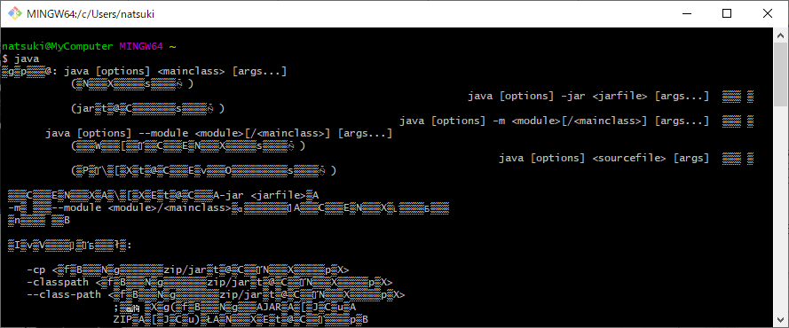

# explain.how_to_fix_garbled_japanese_text.on_gitbash
Git Bash の日本語の文字化けを解消する方法を説明します

## Git Bash で日本語が文字化けする

### 事象
以下の例はローカルに openJDK 11 をインストール済みの場合の事象である。

例えば、Git Bash で `java` コマンドを実行すると、ヘルプメッセージの内容の日本語部分が文字化けしてしまう。

 
 
## 対処方法
もし、コンソールで使用されている文字コードが、Shift JIS なら、Unicode (UTF-8) に変更することで文字化けを防ぐことができる

## 文字コードの確認方法
次のコマンドを実行することで、コンソールの文字コードを確認することができる。

文字コードの確認コマンド:
```console
chcp.com
```
実行結果例:
```
Active code page: 932
```

chcp は change the code page の略で、コードページ番号を変更するコマンド。

指定可能なコードページ番号はマイクロソフトのホームページにて参照が可能である。

Code Page Identifiers:  
https://docs.microsoft.com/en-us/windows/win32/intl/code-page-identifiers

よく利用されるものは次の通りである。

|Identifier	|.NET Name |Additional information |
|:-- |:-- |:-- |
|932	|shift_jis	ANSI/OEM Japanese |Japanese (Shift-JIS) |
|20127	|us-ascii	|US-ASCII (7-bit) |
|51932	|euc-jp	|EUC Japanese |
|65001	|utf-8	|Unicode (UTF-8) |

## Unicode (UTF-8) に変更する方法
コンソールの文字コードを Unicode(UTF-8) にするには、以下のコマンドを実行する。

コンソールの文字コードを Unicode(UTF-8) にする:
```console
chcp.com 65001
```

このコマンドを実行すれば、文字コードは Unicode(UTF-8) になり、日本語の文字化けは解消される。

## 文字コードの初期設定を変更する方法
ただし、コンソール上で chcp.com コマンドを実施して文字コードを変更しても、コンソールを次に起動するときは、また元の文字コードに戻ってしまう。

Git Bash を開いた時に、毎回特定の文字コードにしておきたい場合は、`.bashrc` ファイルを編集する。

`.bashrc` ファイルはユーザディレクトリに存在する。存在しない場合は、新規作成する。

.bashrc ファイルの場所:
```
C:\Users\＜ユーザ名＞
```

例えば、`.bashrc` ファイルに以下の記述を追記する。

Git Bash を開いた時の文字コードを Unicode(UTF-8) にする例:
```
chcp.com 65001
```
